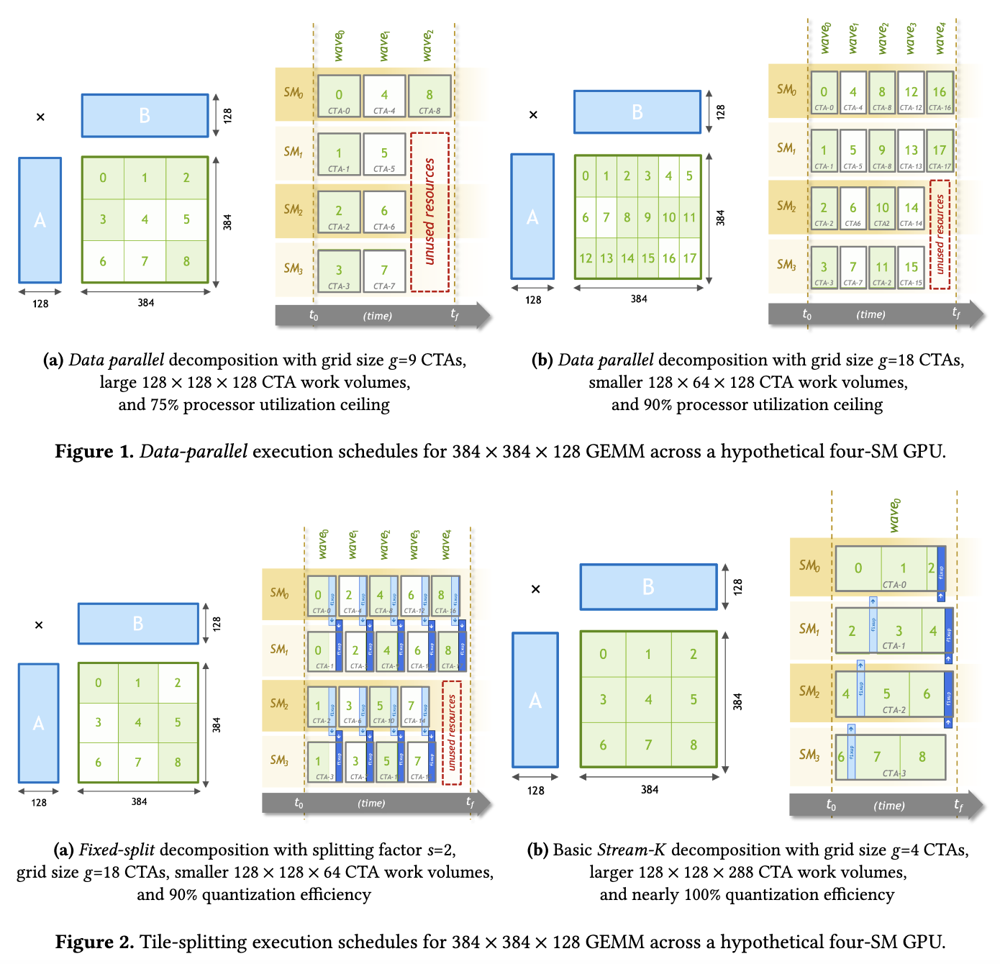

Reproduce the PPoPP'23 Paper [Stream-K: Work-centric Parallel Decomposition for Dense Matrix-Matrix Multiplication on the GPU](http://arxiv.org/abs/2301.03598) with TVM TIR and TL, which could be helpful for us to optimize the performance for small shapes.



Dependencies:

```bash
pip install git+https://github.com/microsoft/BitBLAS.git
```

TODO Items:
- [x] Implement Float16 Tensor Core
- [x] With Vectorized AtomicAdd
- [x] Implement Auto Tune
- [x] With BlockReduction 
- [x] With Ladder Layout Propagation.
- [ ] Apply Padding when the tile shape is not aligned for Swizzling.
- [ ] Implement Dequantize template and integrate with BitBLAS.
